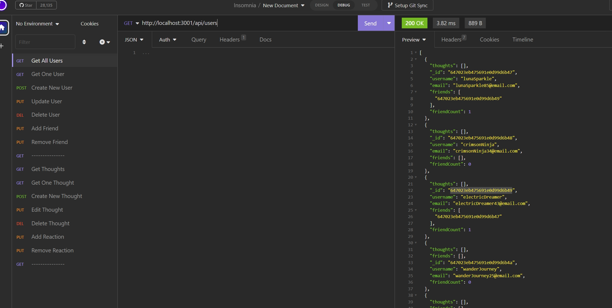
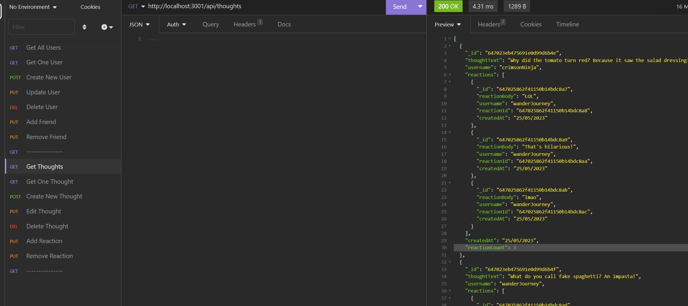

# Social-Media-Backend
A backend for standard social media sites, built with Node, Express, and MongoDB.

A link to the demo video can be found [here](https://drive.google.com/file/d/1g9E9XEskw892D4jTHvWod0xJI46kedqt/view)

## Screenshot

## Features

- Built with Node, Express, MongoDB, and showcased in video demo via Insomnia.
- Users can create an account with unique username and email, share their thoughts, and add each other as friends.
- Each user has full control over their posts, including editing and deleting.
- They can also react to other people's posts as well as editing and deleting their own reactions.

## Table of Contents 

* [Installation](#installation)

* [Usage](#usage)

* [License](#license)

* [Contributing](#contributing)

* [Tests](#tests)

* [Questions](#questions)

## Installation

To install necessary dependencies, run the following command:
~~~
npm i
~~~

Insert connection link to local MongoDB database into the connection.js file directly or via dotenv

To seed the database, run the follow command:
~~~
npm run seed
~~~

## Usage

Perform a git clone and run the code with "npm start"

Recommended softwares: 
- MongoDB Compass to see database changes
- Insomnia to view back end routes

## License

MIT

## Contributing

Fork the repo and create pull requests

## Tests

To run tests, run the following command:
~~~
npm test
~~~
## Questions

If you have any questions about the repo, open an issue or contact me directly at Algarvian2001@yahoo.com. You can find more of my works at [NganPham89](https://github.com/NganPham89).

